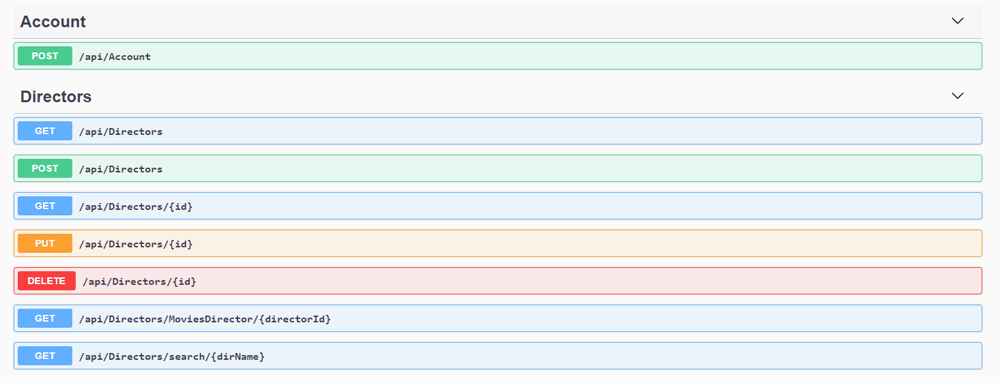
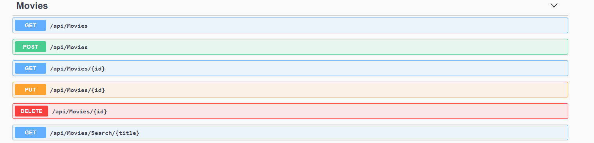
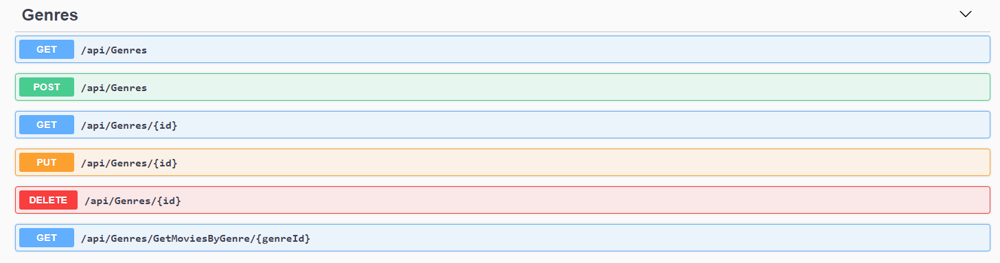

# Movies-FullStackProject

## Movie API

It is the final project of the full stack bootcamp. It was built by using .Net Core. you can see the below Swagger UI and API's endpoints.
Update and delete was secured by using JWT. 

